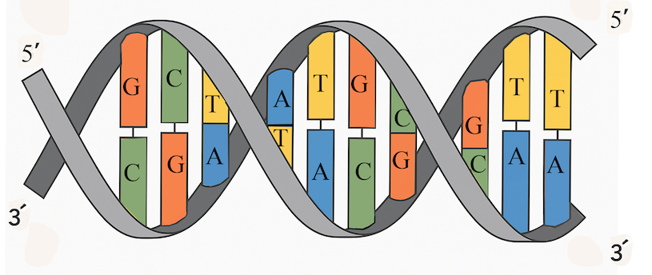

# 🧬 CDaaR-API – Central Dogma as a REST API

<p align="center">
  
</p>

**CDaaR (Central Dogma as a REST API)** is a Flask-based educational web service that models the molecular transcription and translation on cellular environments fundamental to genetics and genomics — including DNA reverse complementation, RNA transcription, reverse transcription to cDNA, and mRNA translation into polypeptides. Built for bioinformatics pipelines, teaching, and data validation, this API reflects on engineered natural selection, as intersection of biology with computing.

🔗 **Live Demo**: [https://dev15.miveh-nejad.info/](https://dev15.miveh-nejad.info/)

---

## API Endpoints

- 🧬 **/DNA/v2/**: Get the reverse complement of a DNA strand.
- 🧫 **/RNA/v2/**: Transcribe DNA to pre-mRNA using canonical base-pairing.
- 🔄 **/CDNA/v2/**: Reverse transcribe mRNA into complementary double-stranded DNA.
- 🧱 **/Polypeptide/v2/**: Translate mRNA into a polypeptide chain of amino acids.

All endpoints:
- Enforce strict nucleotide validation using `Pydantic` models
- Limit input length to 10,000 characters
- Return biologically meaningful orientation (5’ → 3’ and 3’ → 5’)

---

## Example Use Case

```http
GET /RNA/v2/?seq=ATGC

Response:
{
  "Original": "ATGC",
  "RNA_Transcription": " 5'-AUGC-3' "
}

GET /Polypeptide/v2/?seq=AUGGCCAAGUAA

Response:
{
  "Codon": "AUGGCCAAGUAA",
  "Polypeptide": {
    "polypeptide": ["Methionine", "Alanine", "Lysine"],
    "length": 3
  }
}
```

## Local Installation

``` bash
git clone git@github.com:mivehk/CDAAR-API.git
cd CDAAR-API
python3 -m venv cdaar-env
source cdaar-env/bin/activate
python3 -m pip install -e ".[dev]"
python3 cdaar.py

```

## API Documentation
This project uses flask-openapi3 with built-in support for:

Swagger UI
Redoc
RapiDoc
Scalar
RapiPDF
Elements

The API will be available at localhost:5604, with interactive OpenAPI at http://localhost:5604/openapi

## Testing

``` bash
#Run tests using pytest:

pytest tests/
#You can also run PEP8 formatting checks:

black --check .
#GitHub Actions CI is configured to run tests and black checks automatically on each push.
```
## Credits

Developed by <b><i>Kayvan Mivehnejad</i></b> to epitomize bioinformatics workflows in a Flask API.

This API is inspired by educational needs to bring the Central Dogma to life in data-driven platforms.

## License

This project is licensed under the MIT License.
